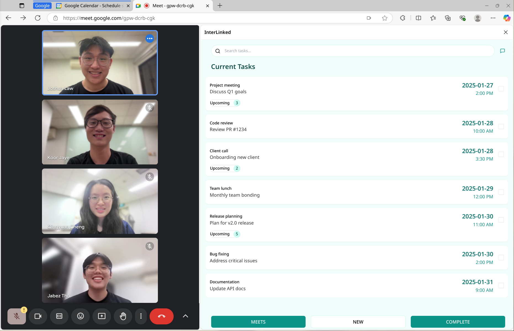

# InterLinked


## Intro
To address the problem statement of Singapore Book Council, with the problems identified as task management, meeting scheduling, and email thread summarization, we have developed InterLinked, a Chrome extension that assist the users to do all that faster and more efficiently.

The premise of InterLinked is simplicity and practicality. We approach the problem statement with the mindset of a user, and not to reinvent the wheel. Hence the extension relies on the user's existing tools, such as Google Calendar and Google Meets, to provide a seamless experience.

## Tech Stack
- React for UI and js for reminders, background sync with calendar (browser service worker)

## Features
- Task management
- Meeting scheduling shortcuts (Google Meets)
- AI-assist for task management and meeting scheduling
- Templates for repeated follow-ups replication
- Integration with Google Calendar
- AI summary of email threads

## Security & Privacy Features
- OAuth2.0 login to authenticate users to access their google contacts, calendar
- All Data stored in user's local storage and not shared with any third-party services (besides google)
- Optional AI features that can be turned off/not used by the user (no data is sent to the server)
- All "backend" code is run on the user's local machine

## Getting started
1. Clone this repository.( ```git clone https://github.com/Jonghakseo/chrome-extension-boilerplate-react-vite``` )
2. Check your node version is >= than in `.nvmrc` file, recommend to use [nvm](https://github.com/nvm-sh/nvm?tab=readme-ov-file#intro)
3. Edit `/packages/i18n/locales/`{your locale(s)}/`messages.json`
4. In the objects `extensionDescription` and `extensionName`, change the `message` fields (leave `description` alone)
5. In `/.package.json`, change the `version` to the desired version of your extension.
6. Install pnpm globally: `npm install -g pnpm` (check your node version >= 22.12.0))
7. Run `pnpm install`

### To Build

1. Run:
    - Prod: `pnpm build`
2. Open in browser - `chrome://extensions`
3. Check - <kbd>Developer mode</kbd>
4. Click - <kbd>Load unpacked</kbd> in the upper left corner
5. Select the `dist` directory from the boilerplate project

### Location of UI
- [`side-panel`](pages/side-panel/) - [sidepanel (Chrome 114+)](https://developer.chrome.com/docs/extensions/reference/api/sidePanel)
  (`side_panel.default_path` in manifest.json)

### Disclaimer
- This extension is a work in progress and features may not have been fully implemented yet.

## Reference
- [chrome-extension-boilerplate-react-vite](https://github.com/Jonghakseo/chrome-extension-boilerplate-react-vite)
